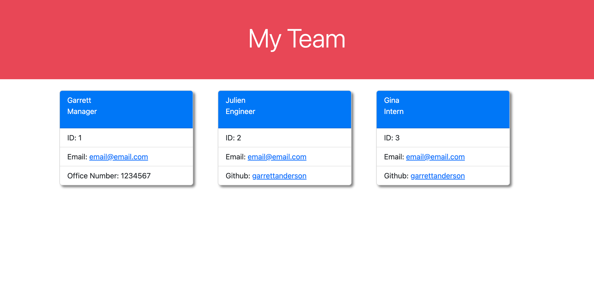

# Team-Profile-Generator
Node.js command-line application that takes in information about employees on a software engineering team and generates an HTML webpage that displays summaries for each person.

## Description

Node.js command-line application that takes in information about employees on a software engineering team and generates an HTML webpage that displays summaries for each person.

## Installation

Just need to download the source files from the github repository onto local. Run 'npm install' to ensure that proper packages are installed.

Once index.html is created, open repository in VSCode and right click on index.html file and select "Open with Live Server". 

## Usage

Node.js command-line application that takes in information about employees on a software engineering team and generates an HTML webpage that displays summaries for each person. To run the program, right click on index.js and click 'open in integrated terminal' to open the terminal in VS Code. Run 'node index' and follow the prompts.

To view this application on Github Pages click [here](https://github.com/GarrettAnderson/team-profile-generator).
To view the video walkthrough of the project click [here](https://drive.google.com/file/d/1YG4p2UcTb9KzQks2QbYah7ZqWmctB2g2/view).

Below is a screenshot of the project:

## Credits

Used the class work assignments as reference points.

## License

There is no license and this repo is available for reproduction.

